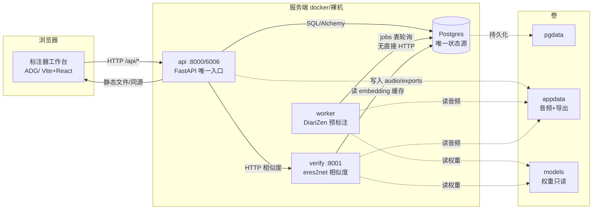
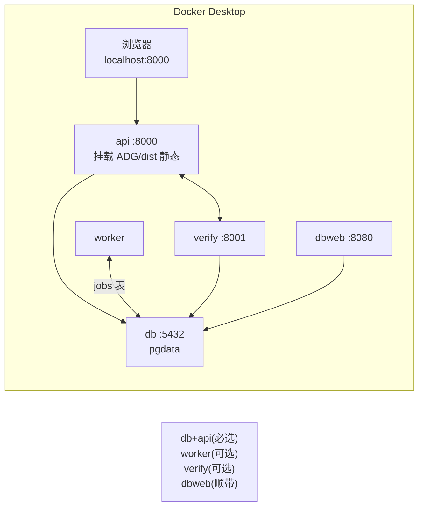
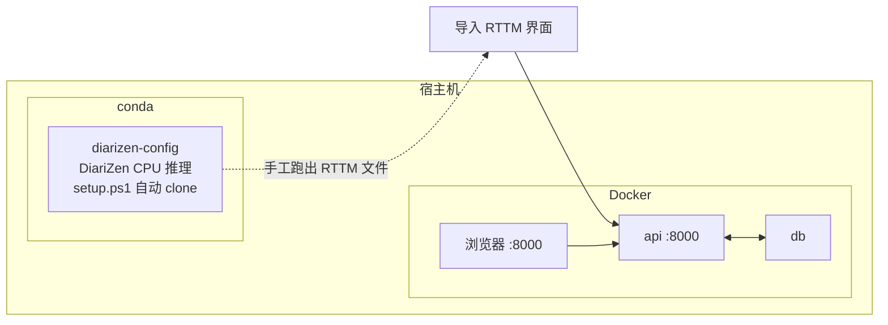
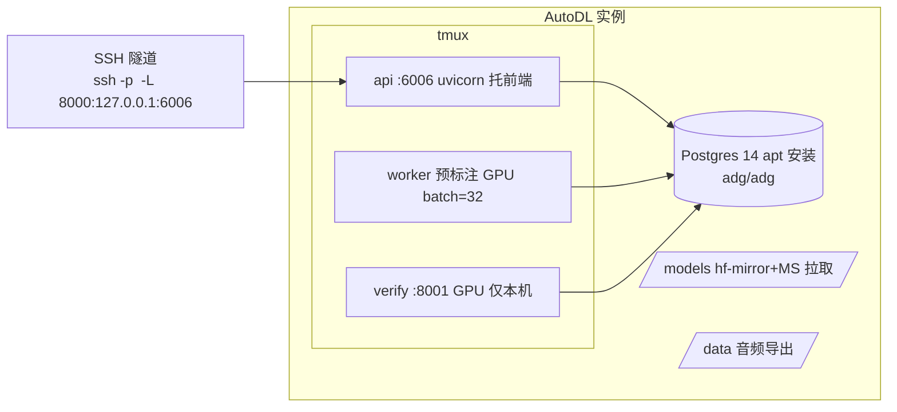

# ADG 系统架构总览

客户端–服务端的**纠错式**标注系统：浏览器只是视图，服务端持有**全部状态**（音频、
标注、任务）；DiariZen 只出预标注草稿，产出的正确性是人工逐段纠错的。同一套
`server/` 代码有三种宿主形态（本机 docker / 本地 conda 推理 / AutoDL 裸机），
跑的是同一套数据契约（Postgres schema + 标准 10 字段 RTTM）。

## 1. 逻辑组件

| 组件 | 代码位置 | 职责 | 数据 | 必选 |
|---|---|---|---|---|
| **浏览器标注器** | `ADG/`（Vite + React + TS + wavesurfer） | 列表认领、波形/时间轴纠错、快捷键走查、相似度面板 | 无 | ✅ |
| **api** | `server/app/`（FastAPI） | 与浏览器**唯一**对话的服务：上传/探测/峰值/标注存取/RTTM 导入导出；托管前端静态文件；调 verify | 读写 db | ✅ |
| **worker** | `server/app/worker/`（DiariZen） | 认领预标注任务 → 跑 DiariZen → 写回预标注；人工认领时自动取消未完成任务 | 写 db | ✖️（可由本地推理替代） |
| **verify** | `server/app/verify/`（eres2net） | 声纹相似度：stable 样本 + 右键自动识别；embedding 按**音频窗口**缓存 | 写 db（缓存） | ✖️（可选，未起则面板提示 503） |
| **Postgres** | compose `db` / AutoDL apt | **唯一状态源**：users / recordings / speakers / segments / jobs / segment_embeddings；schema 由 **Alembic** 管理 | — | ✅ |
| **数据卷** | `appdata`（音频+导出）、`models`（权重，CC BY-NC）、`pgdata` | 音频二进制不进库（DB 只存元数据） | — | ✅ |
| **dbweb（Adminer）** | :8080 | 数据库旁路查看/修理工具，不参与数据流 | — | ✖️ |

关键约定（全系统唯一事实来源）：
- `server/app/rttm.py` —— RTTM 解析/序列化**全系统唯一**（严格 10 字段）；
- `server/app/annotations.py:save_annotation()` —— 用户保存与预标注写入**共用唯一写路径**；
- `server/app/models.py` —— schema 唯一事实来源；升级走 `alembic revision --autogenerate`，
  测试 `alembic check` 保证 models 与库零漂移（见 HANDOFF 九期）；
- DiariZen 的 RTTM **超出音频长度**，入库钳制并明确上报，禁止静默截断。

## 2. 逻辑架构图



```mermaid
flowchart LR
    subgraph 上传
        A[上传音频<br/>api 流式哈希去重 → 探测 → 归一化 16k mono wav → peaks 100点/秒]
    end
    subgraph 预标注(可选)
        B1[预标注按钮<br/>worker 认领跑 DiariZen]
        B2[导入 RTTM<br/>本地 conda 跑出,手动导入]
    end
    subgraph 人工纠错
        C[认领→标注页<br/>J/K 走查 · 1-9 改判 · S/M · N · I 相似度<br/>自动保存(2s 防抖)]
    end
    subgraph 交付
        D[标记完成 → 导出标准 RTTM<br/>md-eval.pl / dscore 直接喂 DER]
    end
    A --> B1 --> C
    A --> B2 --> C
    C --> D
```

## 3. 三种部署形态（同一套 server/ 代码）

### 形态 A：本机 docker compose —— 日常首选



- 命令：`docker compose -f docker-compose.yml -f docker-compose.gpu.yml ...`（GPU 变体，
  `TORCH_VARIANT=cu118`）；`-f` 覆盖仅提 verify/worker——db/api 在两种文件都一致；
- 最小可用 = `docker compose up -d db api`（可标注、导出，无预标注/相似度）；
- 权重只拉一次：`docker compose --profile setup run --rm seed-models`（HF 走
  host 代理 `host.docker.internal:7890`，**不能在起 seed-models 时跳过代理**，MS 直连）。

### 形态 B：本地 conda DiariZen + docker db/api —— 无 worker 时的替代



- 适用：**未构建 worker 镜像**（torch 下载慢）或只想在本地验证推理参数；
- 推理产物（RTTM）经「导入 RTTM」进入数据库——**本地推理不直接接触数据库**，分隔干净；
- `diarizen-config/`（`SETUP_CPU.md` / `setup.ps1` / `run_example_cpu.py`）
  只负责「在某台机器上跑出 .rttm 文件」；与 server/ 唯一耦合点是文件格式与音频时长。
- 单独跑时**接口一致性依赖协议**：RTTM 字段、speaker label 与 server 的
  chipset 处理对齐（见 `app/ingest.py`、`app/rttm.py`）。

### 形态 C：AutoDL 裸机（远程 GPU，无 docker）—— 正式生产

> AutoDL 容器不允许 docker，部署脚本在裸机上复刻同一套服务。



- 布局与启动：`/srv`（app + static + download_models.py）、`/opt/diarizen/DiariZen`、
  venv 开 `--system-site-packages` 复用镜像 torch 2.1.x+cu121；`start_services.sh` 幂等起/补全；
  一键脚本 `scripts/deploy/*` + `scripts/remote_ssh.py`（凭据不入库）；
- **权重走 hf-mirror.com（~4.4 MB/s）+ ModelScope 直连（~12 MB/s）**，比 compose 本机（代理 ~0.24 MB/s）
  快一个数量级——这是远程部署的核心优势；
- GPU 时 `batch_size` 自动 32（CPU 回落 4，`DIARIZEN_BATCH_SIZE` 可覆盖）。

## 4. 端口 / 卷 / 环境变量速查

| 位置 | 值 | 说明 |
|---|---|---|
| api | `:8000`(docker) / `:6006`(AutoDL 公网映射) | 浏览器唯一入口；健康检查 `/healthz` |
| verify | `:8001` | 仅本机网络，api 经 `VERIFY_URL` 调用 |
| dbweb(Adminer) | `:8080` | server=db / user=adg / password=adg / db=adg |
| Postgres | compose :5432（16）/ AutoDL apt（14） | 端口不对外 |
| pgdata / appdata / models | compose 命名卷 | AutoDL 用目录替代：`/root/autodl-tmp/adg/{models,data}` |

**环境变量**（`server/app/config.py`，默认值取 compose）：`DATABASE_URL`（db）、`DATA_DIR`
（appdata）、`MODELS_DIR`、`VERIFY_URL`（冒号不是 IP）、`EMBEDDING_DEVICE=auto`、
`TORCH_NUM_THREADS=10`、`DIARIZEN_BATCH_SIZE`。

## 5. 文档与代码位置索引

- 部署细节：`docs/deploy-autodl.md`（C 形态）、README.md「自动预标注 worker」「远程 GPU 部署」小节
- 迁移决策依据：`docs/intent/`（意图书：为什么要纠错式/声纹）、`docs/spec/`（方案落地）
- 交接与验证史：`docs/HANDOFF.md`（做了什么、验证到什么程度、还欠什么）
- 任务记录：`tasks/YYYY-MM-DD/`（**不入 git**）
